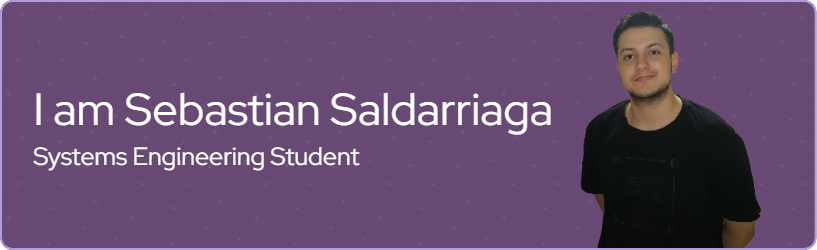

# Hi there... 👋

  

## 👩‍💻 About Me

I'm a Systems Engineering student at Universidad de Antioquia, currently residing in Medellín, Colombia.  
- 🔭 I am still in the early stages of my career and haven't gained industry experience yet, but I am deeply passionate about backend programming aiming to become a Fullstack Developer.  
- 📚 I've worked with a variety of programming languages, including Java, JavaScript/TypeScript, and Kotlin. My love for technology continues to drive my enthusiasm for learning and growing in this ever-evolving field.  
- ⚡ In my free time, I enjoy expanding my knowledge by exploring new languages and technologies. Besides my tech interests, I am an avid gamer and sports enthusiast, with a particular love for football and basketball.

## 🔧 Skills

  <table>
    <tr>
      <td><h3 align="center">📝 Languages</h3></td>
      <td><h3 align="center">📚 Frameworks/ Libraries</h3></td>
      <td><h3 align="center">💾 Databases</h3></td>
      <td><h3 align="center">☁️ Cloud Platforms/ Deployment</h3></td>
    </tr>
    <tr>
      <td align="center">
        
      </td>
      <td align="center">
        
      </td>
      <td align="center">
        
      </td>
      <td align="center">
        
      </td>
    </tr>
    <tr>
      <td align="center">
        
      </td>
      <td align="center">
        
      </td>
      <td align="center">
        
      </td>
      <td align="center">
        
      </td>
    </tr>
    <tr>
      <td align="center">
        
      </td>
      <td align="center">
        
      </td>
      <td align="center">
        

      </td>
      <td align="center">
        
      </td>
    </tr>
    <tr>
      <td align="center">
        
      </td>
      <td align="center">
        
      </td>
      <td align="center">
        

      </td>
      <td align="center">
        

      </td>
    </tr>
  </table>

## 📈 GitHub Stats

  

## 📫 Contact Me

  
  
  

## 🔗 Links

- [Porfolio](https://sebastian-saldarriaga-portafolio.vercel.app/)

## 👀 Thanks for stopping by!

Feel free to connect with me! Looking forward to learning and collaborating together.
